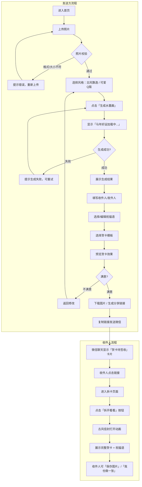
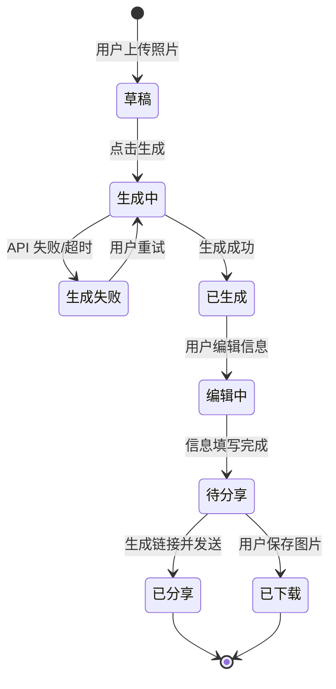

# 产品需求文档：马年贺卡祝福语项目 - V1.0

## 1. 综述 (Overview)

### 1.1 项目背景与核心问题

2025年是中国农历马年，春节期间人们有互相发送祝福的习惯。传统的文字祝福或普通贺卡缺乏个性化和惊喜感。

**核心问题**：用户希望发送一份独特、有创意、有仪式感的春节祝福，但缺乏设计能力和工具。

**解决方案**：提供一个无需登录的网页工具，用户上传照片后，通过 AI（Gemini 2.0 Flash）生成中国风水墨画风格的个性化贺卡，可下载或生成分享链接发送给微信好友，收件人将获得「拆卡」的惊喜体验。

**产品风格**：水墨淡雅中国风 + 可爱元素 + 马年主题 + 动态交互效果

---

### 1.2 核心业务流程 / 用户旅程地图

| 阶段 | 名称 | 用户目标 |
|------|------|----------|
| **1** | 进入首页 | 用户直接看到制作界面，无需额外引导 |
| **2** | 上传照片 | 用户选择/上传一张自己的照片 |
| **3** | 选择风格 | 用户选择「古风飘逸」或「可爱Q版」风格 |
| **4** | AI 生成水墨画 | 系统调用 Gemini 生成水墨画风格人像 |
| **5** | 编辑贺卡 | 用户填写收件人、发件人、选择/编辑祝福语、选择贺卡模板 |
| **6** | 保存 / 分享 | 用户下载图片或生成分享链接 |
| **7** | 微信卡片展示 | 收件人在微信聊天中看到「贺卡待签收」神秘卡片 |
| **8** | 拆卡惊喜 | 收件人点击进入拆卡页，点击「拆开」触发动画，揭晓贺卡 |

---

### 1.3 Mermaid 图

#### 1.3.1 用户操作流（必填）



#### 1.3.2 贺卡状态机



---

## 2. 用户故事详述 (User Stories)

---

### US-01: 主页面 - 制作贺卡

* **价值陈述 (Value Statement)**:
    * **作为** 一个想发送春节祝福的用户
    * **我希望** 在一个页面内完成照片上传、风格选择、AI生成、编辑祝福语、保存和分享的全部操作
    * **以便于** 快速制作一张个性化的马年贺卡

* **业务规则与逻辑 (Business Logic)**:

    1. **前置条件**:
        - 用户通过浏览器访问网页
        - 无需登录注册

    2. **操作流程 (Happy Path)**:
        | 步骤 | 用户操作 | 系统反馈 |
        |------|----------|----------|
        | 1 | 进入网页 | 展示主页面（左右布局） |
        | 2 | 点击上传区域或拖拽照片 | 显示照片预览 |
        | 3 | 选择风格（古风飘逸/可爱Q版） | 高亮选中风格 |
        | 4 | 点击「生成水墨画」 | 显示「🐴 马年好运加载中...」 |
        | 5 | 等待生成完成 | 展示 AI 生成的水墨画 |
        | 6 | 填写「送给」「来自」 | 实时显示在预览中 |
        | 7 | 选择预设祝福语或自定义输入 | 实时显示在预览中 |
        | 8 | 选择贺卡模板 | 点击可放大预览 |
        | 9 | 可选：勾选「分享时显示我的名字」 | 控制微信卡片是否显示发件人 |
        | 10 | 点击「保存图片」 | 下载合成后的完整贺卡到本地 |
        | 11 | 点击「生成链接」 | 生成唯一分享链接，显示复制按钮 |

    3. **异常处理 (Error Handling)**:
        | 异常场景 | 系统行为 |
        |----------|----------|
        | 照片格式不支持 | 提示「请上传 JPG 或 PNG 格式的图片」 |
        | 照片超过 5MB | 提示「图片过大，请上传 5MB 以内的图片」 |
        | AI 生成失败 | 提示「生成失败，请重试」，显示重试按钮 |
        | AI 生成超时（30秒） | 提示「生成超时，请重试」 |
        | 必填字段未填写 | 点击保存/生成链接时，提示「请填写收件人和发件人」 |

* **验收标准 (Acceptance Criteria)**:

    * **场景1: 成功上传照片**
        * **GIVEN** 用户在主页面
        * **WHEN** 用户上传一张 2MB 的 JPG 照片
        * **THEN** 照片显示在左侧预览区域

    * **场景2: 成功生成水墨画**
        * **GIVEN** 用户已上传照片并选择风格
        * **WHEN** 用户点击「生成水墨画」
        * **THEN** 显示 Loading 动画，生成完成后展示水墨画结果

    * **场景3: 生成失败重试**
        * **GIVEN** AI 生成失败
        * **WHEN** 用户点击「重试」
        * **THEN** 重新调用 AI 生成

    * **场景4: 成功保存图片**
        * **GIVEN** 用户已完成贺卡编辑
        * **WHEN** 用户点击「保存图片」
        * **THEN** 浏览器下载合成后的贺卡图片

    * **场景5: 成功生成分享链接**
        * **GIVEN** 用户已完成贺卡编辑
        * **WHEN** 用户点击「生成链接」
        * **THEN** 显示唯一链接和复制按钮

---

* **页面布局线框图 (ASCII Wireframe)**:

**桌面端：**

```text
+-----------------------------------------------------------------------------------+
|                                                                    [🐴马年元素]    |
|   +-------------------------------+       +-----------------------------------+   |
|   |                               |       |                                   |   |
|   |     [点击上传照片]             |       |   送给: [__________________]      |   |
|   |     支持 jpg/png              |       |   来自: [__________________]      |   |
|   |     (或拖拽到此处)             |       |                                   |   |
|   |                               |       |   祝福语: [预设模板 v]             |   |
|   |   ┌─────────────────────┐    |       |   +-----------------------------+ |   |
|   |   │   照片预览 / 水墨画  │    |       |   |   新春快乐，万事如意...      | |   |
|   |   │   (点击可放大)       │    |       |   +-----------------------------+ |   |
|   |   └─────────────────────┘    |       |                                   |   |
|   |                               |       |   风格: [古风飘逸] [可爱Q版]       |   |
|   |   [重新上传]    [生成水墨画]   |       |   贺卡模板: [1] [2] [3] ...       |   |
|   +-------------------------------+       |   (点击可放大预览)                 |   |
|                                           |                                   |   |
|                                           |   ☑️ 分享时显示我的名字            |   |
|                                           |                                   |   |
|                                           |   +-------------+ +-------------+ |   |
|                                           |   | 📤 生成链接  | | 💾 保存图片  | |   |
|                                           |   +-------------+ +-------------+ |   |
|                                           +-----------------------------------+   |
+-----------------------------------------------------------------------------------+
```

**手机端（上下排列）：**

```text
+----------------------------------+
|                       [🐴马年]    |
+----------------------------------+
|   [点击上传照片]                  |
|   支持 jpg/png                   |
|   ┌──────────────────────────┐  |
|   │    照片预览 / 水墨画      │  |
|   │    (点击可放大)           │  |
|   └──────────────────────────┘  |
|   [重新上传]     [生成水墨画]     |
+----------------------------------+
|   送给: [__________________]     |
|   来自: [__________________]     |
|   祝福语: [预设模板 v]            |
|   +----------------------------+ |
|   |  新春快乐，万事如意...      | |
|   +----------------------------+ |
|   风格: [古风飘逸] [可爱Q版]      |
|   贺卡模板: [1] [2] [3]          |
|   ☑️ 分享时显示我的名字          |
|   +------------+ +------------+  |
|   | 📤 生成链接 | | 💾 保存图片 |  |
|   +------------+ +------------+  |
+----------------------------------+
```

---

### US-02: 收卡页面 - 拆卡惊喜体验

* **价值陈述 (Value Statement)**:
    * **作为** 收到贺卡链接的用户
    * **我希望** 在微信中看到神秘的「贺卡待签收」卡片，点击后有拆卡的惊喜仪式感
    * **以便于** 获得温暖有趣的收礼体验

* **业务规则与逻辑 (Business Logic)**:

    1. **前置条件**:
        - 发送方已生成分享链接
        - 收件人在微信中收到链接

    2. **操作流程 (Happy Path)**:
        | 步骤 | 用户操作 | 系统反馈 |
        |------|----------|----------|
        | 1 | 在微信聊天中看到链接 | 显示卡片预览：「有一张来自 XX 的贺卡待签收」或「有一张神秘贺卡待签收」 |
        | 2 | 点击链接 | 进入拆卡页面 |
        | 3 | 查看页面 | 显示古风信封（蜡封/红绳元素）+ 来自/送给信息 |
        | 4 | 点击「拆开看看」 | 播放古风信封打开动画，贺卡滑出 |
        | 5 | 查看贺卡 | 展示水墨画 + 祝福语 + 收发件人 |
        | 6 | 点击「保存图片」 | 下载贺卡到本地 |
        | 7 | 点击「我也做一张」 | 跳转到主页面 |

    3. **异常处理 (Error Handling)**:
        | 异常场景 | 系统行为 |
        |----------|----------|
        | 链接无效/过期 | 提示「贺卡不存在或已过期」，显示「去制作一张」按钮 |
        | 图片加载失败 | 显示占位图，提示「图片加载失败，请刷新重试」 |

* **验收标准 (Acceptance Criteria)**:

    * **场景1: 微信卡片显示发件人**
        * **GIVEN** 发送方勾选了「分享时显示我的名字」
        * **WHEN** 收件人在微信中看到链接
        * **THEN** 卡片显示「有一张来自 XX 的贺卡待签收」

    * **场景2: 微信卡片隐藏发件人**
        * **GIVEN** 发送方未勾选「分享时显示我的名字」
        * **WHEN** 收件人在微信中看到链接
        * **THEN** 卡片显示「有一张神秘贺卡待签收」

    * **场景3: 成功拆卡**
        * **GIVEN** 收件人在拆卡页面
        * **WHEN** 点击「拆开看看」
        * **THEN** 播放信封打开动画，展示完整贺卡

    * **场景4: 保存贺卡**
        * **GIVEN** 收件人已拆开贺卡
        * **WHEN** 点击「保存图片」
        * **THEN** 浏览器下载贺卡图片

    * **场景5: 跳转制作**
        * **GIVEN** 收件人已拆开贺卡
        * **WHEN** 点击「我也做一张」
        * **THEN** 跳转到主页面

---

* **页面布局线框图 (ASCII Wireframe)**:

**拆卡前：**

```text
+------------------------------------+
|                                    |
|          🐴 马年大吉 🐴             |
|                                    |
|   ┌──────────────────────────┐    |
|   │    ╭─────────────────╮   │    |
|   │    │                 │   │    |
|   │    │   [古风信封]     │   │    |
|   │    │   竹简/蜡封风格   │   │    |
|   │    │                 │   │    |
|   │    │    ✉️ 待签收     │   │    |
|   │    │   🔴 红绳装饰    │   │    |
|   │    │                 │   │    |
|   │    ╰─────────────────╯   │    |
|   └──────────────────────────┘    |
|                                    |
|         来自：小明                  |
|         送给：小红                  |
|                                    |
|          [ 🎉 拆开看看 ]            |
|                                    |
+------------------------------------+
```

**拆卡后：**

```text
+------------------------------------+
|                                    |
|          🐴 马年大吉 🐴             |
|                                    |
|   ┌──────────────────────────┐    |
|   │                          │    |
|   │    [AI 生成的水墨画]      │    |
|   │                          │    |
|   │                          │    |
|   └──────────────────────────┘    |
|                                    |
|         送给：小红                  |
|         来自：小明                  |
|                                    |
|    「马到成功，新春大吉！」          |
|                                    |
|   +------------+  +------------+   |
|   | 💾 保存图片 |  | 🎨 我也做一张 |   |
|   +------------+  +------------+   |
|                                    |
+------------------------------------+
```

---

## 3. 附录

### 3.1 Gemini 生图 Prompt

**风格A：古风飘逸人像**

```
Transform this photo into a traditional Chinese ink wash painting style portrait.

Style requirements:
- Traditional Chinese ink painting (水墨画) aesthetic with delicate watercolor washes
- Elegant flowing lines with visible brush stroke texture
- Color palette: soft pinks, vermillion red, ink black, rice paper white, subtle jade green
- Character wearing traditional Chinese Hanfu clothing with flowing sleeves and elegant draping
- Background: minimalist with scattered plum blossoms or cherry blossoms petals falling
- Add subtle ink wash mountains or mist in the far background
- Include a small red seal stamp (印章) in the corner
- Maintain the person's facial features and likeness while stylizing them
- Year of the Horse elements: subtle horse motifs in clothing patterns or a small decorative horse accessory
- Overall mood: serene, poetic, traditional Chinese painting elegance
- Aspect ratio: portrait orientation
```

**风格B：可爱Q版人像**

```
Transform this photo into a cute Chinese New Year illustration style.

Style requirements:
- Adorable chibi/Q-version character design with big expressive eyes
- Traditional Chinese ink wash painting texture as base
- Color palette: warm vermillion red, soft pink, pine green, cream yellow, gentle orange
- Character wearing cute traditional Chinese festive clothing (Tang suit or Hanfu)
- Background: festive Chinese New Year scene with traditional architecture, snow, or blooming trees
- Decorative elements: red lanterns, lucky clouds, auspicious patterns, falling petals or snow
- Include cute Year of the Horse elements: small horse companions, horse-themed accessories, or horse zodiac symbols
- Add a red seal stamp (印章) in the corner
- Maintain the person's recognizable features while making them cute and stylized
- Overall mood: warm, festive, joyful celebration atmosphere
- Aspect ratio: portrait orientation
```

---

### 3.2 预设祝福语（10条）

| 编号 | 祝福语 |
|------|--------|
| 1 | 马到成功，新春大吉！ |
| 2 | 龙马精神，万事如意！ |
| 3 | 策马奔腾，前程似锦！ |
| 4 | 一马当先，好运连连！ |
| 5 | 马年行大运，福气满满来！ |
| 6 | 金马迎春，阖家幸福！ |
| 7 | 马踏祥云，心想事成！ |
| 8 | 千里马年，步步高升！ |
| 9 | 马上有福，马上有钱，马上有一切！ |
| 10 | 愿你新的一年，快马加鞭，奔向美好！ |

---

### 3.3 技术方案建议

| 层级 | 技术 | 说明 |
|------|------|------|
| 前端 | HTML + CSS + JavaScript | 基础技术栈 |
| 框架（可选） | Vue / React | 提升开发效率 |
| 后端 | Vercel Serverless | 免费、简单、自动部署 |
| AI 接口 | Gemini 2.0 Flash | 图片生成 |
| 存储 | Firebase Storage | 存储生成的图片 |
| 数据库 | Firebase Firestore | 存储贺卡数据，生成分享链接 |
| 部署 | Vercel | 连接 GitHub 自动部署 |

---

### 3.4 Open Graph 配置（微信分享卡片）

**显示发件人：**
```html
<meta property="og:title" content="有一张来自 XX 的贺卡待签收 🐴" />
<meta property="og:description" content="点击查看来自好友的新春祝福" />
<meta property="og:image" content="[古风信封封面图]" />
```

**隐藏发件人：**
```html
<meta property="og:title" content="有一张神秘贺卡待签收 🐴" />
<meta property="og:description" content="点击查看来自好友的新春祝福" />
<meta property="og:image" content="[古风信封封面图]" />
```

---

## 4. 参考图片风格说明

本项目参考以下风格特征：

| 特征 | 描述 |
|------|------|
| **画风基底** | 中国传统水墨画 + 现代插画结合 |
| **色彩体系** | 中国传统色：朱红、松绿、淡粉、米黄、水墨灰 |
| **线条风格** | 清晰流畅的线稿 + 水墨晕染质感 |
| **人物风格** | 可爱 Q 萌 或 古风飘逸（两种路线） |
| **场景元素** | 梅花/樱花、松树、古建筑、山水、雪景 |
| **节庆元素** | 红灯笼、福字、飘带、烟花、红包 |
| **装饰细节** | 红色印章、祥云纹、传统纹样 |

---

*文档版本：V1.0*
*创建日期：2025年2月6日*
*状态：已定稿*
